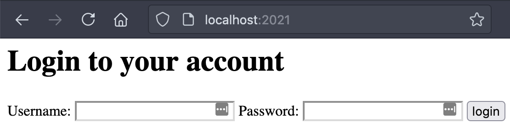

# Web Session Security demo and talk

Cookie, Cross-site scripting, CSRF

## How to play with this demo

- `yarn` to install dependencies
- `yarn start` followed by the file directory eg. `yarn start src/1.1-cookie.ts`
- Visit localhost:2021 on your favourite browser

Credentials are:

- alice/couch
- bob/potato

## How to view slide decks

Run `yarn deck`

## Resources

- SameSite Cookie Attribute Explained by Example (Strict, Lax, None & No SameSite) by Hussein Nasser - https://youtu.be/aUF2QCEudPo
- Free Stanford Web Security course CS253 - https://web.stanford.edu/class/cs253/
- https://developer.mozilla.org/en-US/docs/Web/HTTP/Cookies
- https://cheatsheetseries.owasp.org/cheatsheets/Session_Management_Cheat_Sheet.html#introduction
